# myTrack

Music made for you, not for an algorithm.

myTrack is a personalized AI music app that learns from your listening history, builds a sound profile, and generates original tracks designed around your taste.

## What this project does

myTrack combines Spotify listening signals with Gemini model workflows to generate full songs, cover art, and searchable metadata. The app is built with Next.js and uses Clerk for authentication plus Supabase for storage and data.

### Highlights

- Spotify sync to build a taste profile from top tracks, top artists, and audio features
- Guided song generation flow (idea → prompt → music → cover)
- Library with play tracking, ratings, and shareable songs
- Playlist CRUD with ordering and public/private visibility
- Semantic search powered by embeddings + pgvector
- Queue/resurface logic to bring back highly rated tracks

## Tech stack

- **Frontend/App**: Next.js 14 + React
- **Auth**: Clerk (including Spotify connection)
- **Database/Storage**: Supabase Postgres + Supabase Storage
- **AI/Generation**:
  - Gemini Flash (idea generation)
  - Gemini Pro (prompt refinement)
  - Lyria 3 Pro (music generation)
  - Nano Banana (cover generation)
  - Gemini Embedding (semantic search)

## How it works

At a high level, the app:

1. Authenticates the user and connects Spotify
2. Syncs listening data and computes a sound profile
3. Generates ideas, prompts, audio, and artwork
4. Stores assets + metadata in Supabase
5. Feeds user playback/rating behavior back into future generation

```mermaid
flowchart LR
    U[User] --> A[Sign in with Clerk]
    A --> B[Connect Spotify]
    B --> C[Spotify Sync API]

    C --> D[Build Sound Profile: top tracks + audio features]
    D --> E[Adaptive Generation Engine]

    E --> F1[Idea Generation: Gemini Flash]
    F1 --> F2[Lyrics and Prompt: Gemini Pro]
    F2 --> F3[Music Creation: Lyria]
    F2 --> F4[Cover Art: Nano Banana]

    F3 --> G[Store Audio in Supabase Storage]
    F4 --> H[Store Cover in Supabase Storage]
    G --> I[Song Record in Supabase DB]
    H --> I

    I --> J[User Playback in Generate and Library]
    J --> K[User Feedback: play count + rating]

    K --> L[Resurface and Queue Logic]
    L --> E

    I --> M[Embedding Generation: Gemini Embedding]
    M --> N[Vector Search with pgvector]
    N --> O[Semantic Library Search]
```



## Routes you will use most

- `/dashboard` — profile summary + recent songs
- `/generate` — concept selection and song creation flow
- `/library` — generated songs with search and playback
- `/playlists` — playlist management
- `/share/[id]` — public song sharing page

## Local development

### 1) Install dependencies

```bash
cd app
npm install
```

### 2) Configure environment variables

Create your local env file for the Next.js app and provide:

- `NEXT_PUBLIC_SUPABASE_URL`
- `NEXT_PUBLIC_SUPABASE_ANON_KEY`
- `SUPABASE_SERVICE_ROLE_KEY`
- `GEMINI_API_KEY`
- Clerk keys required by your environment (for auth and OAuth)

### 3) Start the app

```bash
npm run dev
```

Open `http://localhost:3000`.

## Build and test

From the `app` directory:

```bash
npm run build
npx playwright test
```

## Project docs

Detailed vendor/API references are indexed in:

- `docs/INDEX.md`

Use that index as the entry point for Clerk, Gemini, Supabase, Spotify, pgvector, and Playwright docs.
